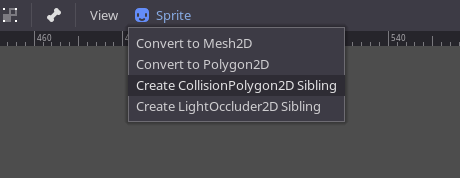

# Create collision shapes from sprites in Godot 3.1

*Notice: this will not work in 3.0!*

*Notice 2: this is probably outdated with the new features added in 3.2:*

## Instructions on how to create MeshInstance from Sprite

1. Create a sprite and assign its texture.
v
2. Select the node sprite, at the top panel of the viewport click "Sprite".

3. In the popup menu, press "Convert to 2D Mesh".

    

4. In the window dialog, press "Create 2D Mesh" button.

    

5. Study StaticBody2D.gd for further explanations.

The created `MeshInstance` can be used to retrieve its faces consisting of
triangles which can be added to collision body dynamically.